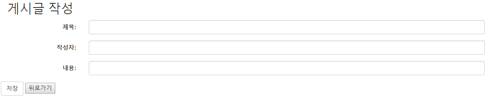

# Spring-boot 게시판 만들기 
  - 개발환경
  - IDE : Intellij IDEA 2018.1.6
  - Spring boot
  - MAVEN
  - MariaDB

## Sequence Diagram

 

## Component Diagram
 

# 게시판 실행 화면

  

 게시판 시작 화면 <localhost:8080/boards>

  

 게시글 작성 화면 <localhost:8080/board/new>

  

 게시글 상세보기 화면 <localhost:8080/board/{id}>

  

 게시글 수정 화면  <localhost:8080/board/edit/{id}>

# 참조
    - https://springframework.guru"# Web-Board" 
